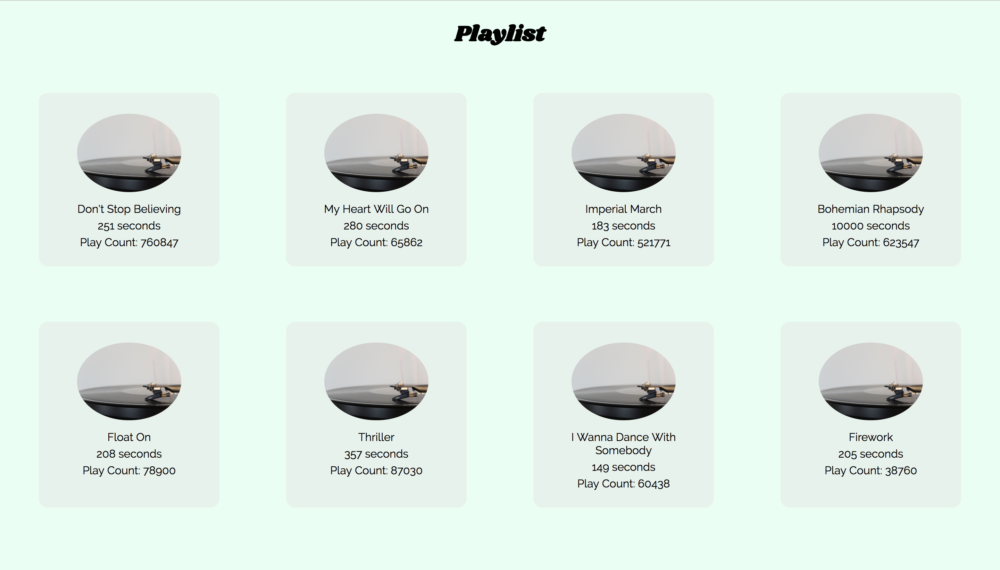

# Static Comp Challenge 1 - Backend Module 2
## Specification

This static comp challenge will keep you exercising that HTML/CSS muscle. 💪 You will be asked to recreate the image below by recreating the screenshot using HTML and CSS.

In other static comp challenges (but not this one), we'll give you a bit of flexibility, however the objective is to build something that very closely represents the original design.

Once you get into the workforce, building out comps that reflect the designer's choice in layout, spacing, font, imagery, and color to the smallest detail, is a requirement.

## The Challenge
Your challenge is to recreate the following image using HTML and CSS. You've been given some initial files to help you get started. Open up your set-list repo and update your songs/index.erb file to reflect the one provided. 

## Base Requirements
Only work for one hour!
Include a screenshot of your work in a browser
Submit your work through a PR

.
